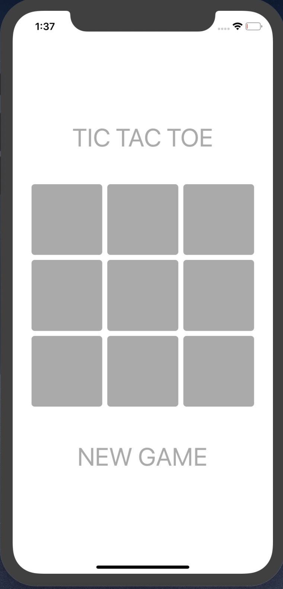
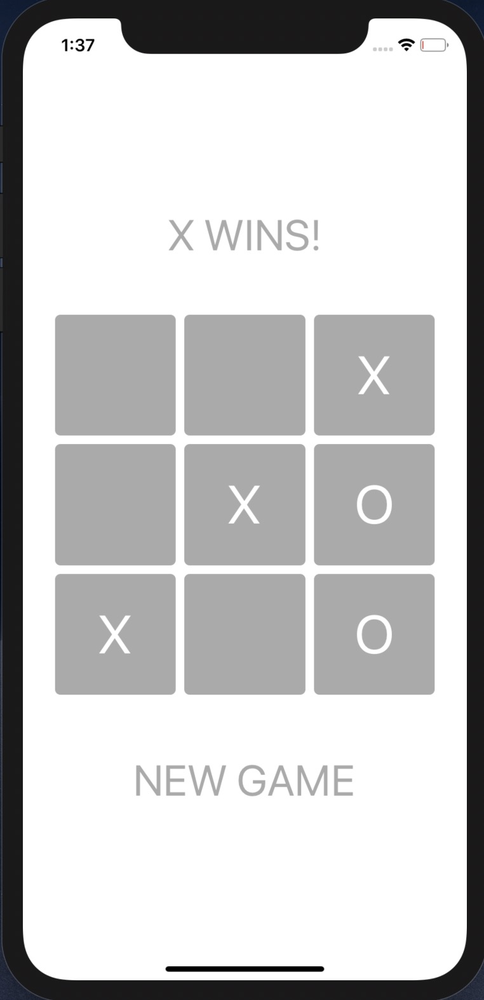

# Tic-Tac-Toe
This is a simple yet comprehensive Tic-Tac-Toe game for iOS, written in Swift. 

This iOS application uses a MVC framework. 

### DEMO

In the future I will create an AI that plays a user. I will also extend this to be compatible with iOS Messages. 
